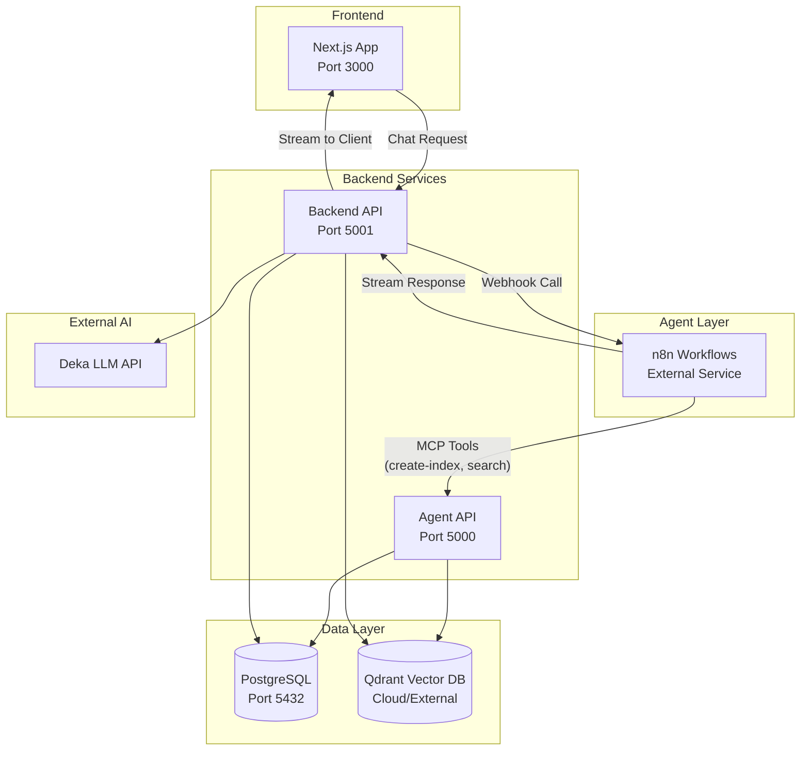

# RAG Backend Technical Summary

**Prepared for:** PPA Project  
**Date:** December 4, 2025  
**Project:** BRA Team Contract Management

---

## 1. Resource Usage Requirements

### Compute Resources

| Component           | Resource                   | Notes                                                        |
| ------------------- | -------------------------- | ------------------------------------------------------------ |
| **Backend Workers** | 30 concurrent threads      | `ThreadPoolExecutor(max_workers=30)` for document processing |
| **OCR Processing**  | ~700s timeout per page     | High-resolution image conversion (3x zoom)                   |
| **Embedding Batch** | 64 chunks per batch        | Configurable via `BATCH_SIZE` environment variable           |
| **Memory**          | RAM-only processing states | No file-based logging for processing states                  |

### External Services

| Service                 | Model                            | Purpose                                        |
| ----------------------- | -------------------------------- | ---------------------------------------------- |
| **Deka AI (OCR)**       | `meta/llama-4-maverick-instruct` | Vision-based OCR for PDF pages                 |
| **Deka AI (Embedding)** | `baai/bge-multilingual-gemma2`   | Multilingual text embeddings                   |
| **Deka AI (Indexing)**  | `qwen/qwen3-coder`               | Structured data extraction                     |
| **Qdrant Cloud**        | Vector Database                  | Document storage and similarity search         |
| **PostgreSQL**          | Database                         | Chat history, users, extracted structured data |

### Storage Requirements

- **OCR Cache:** Local JSON files stored per company/document in `backend/ocr_cache/`
- **Knowledge Base:** PDF documents stored in `knowledge/{company_id}/`
- **PostgreSQL Volume:** Persistent storage for chat history and extracted data

---

## 2. Scalability and Performance

### Current Architecture Capacity

| Metric                                 | Value           | Details                            |
| -------------------------------------- | --------------- | ---------------------------------- |
| **Max Concurrent Document Processing** | 30 jobs         | Single backend instance limit      |
| **Embedding Throughput**               | 64 chunks/batch | Batched API calls to Deka AI       |
| **OCR Retry Logic**                    | 3 attempts      | Exponential backoff (2^n seconds)  |
| **Processing States**                  | In-memory       | States lost on restart (by design) |

### Bottlenecks & Considerations

1. **OCR Processing Time:** Primary bottleneck - each page requires a vision AI API call with 700s timeout
2. **Single Instance:** Current design runs on single backend instance
3. **API Rate Limits:** Dependent on Deka AI service limits
4. **Qdrant Ingestion:** Batch upserts of 64 vectors at a time

### Scalability Options

- **Horizontal:** Docker-compose supports multiple backend replicas
- **Vertical:** Increase `MAX_CONCURRENT_JOBS` (currently 30)
- **Caching:** OCR results cached to avoid reprocessing

---

## 3. Key Features: Document Processing Pipeline

### 3.1 OCR Process

```
PDF Upload → Convert Page to Image (3x zoom JPEG) → Deka AI Vision API → Text Extraction
```

**Technical Details:**

- **Library:** PyMuPDF (`fitz`) for PDF rendering
- **Image Format:** JPEG at 80% quality, 3x zoom for clarity
- **Model:** `meta/llama-4-maverick-instruct`
- **Token Limit:** 8,000 tokens per page
- **Features:**
  - Preserves tables in Markdown format
  - Handles Indonesian/English text
  - Marks unclear text as `???`
  - Blank fields marked as `N/A`

**Source:** [`backend/services/ocr_service.py`](file:///d:/WORK/RAGFrontend/BRAFrontend/rag/backend/services/ocr_service.py)

---

### 3.2 Chunking Strategy

**Approach:** **Page-Based Chunking** - Each PDF page becomes one chunk

**Chunk Structure:**

```
Company: {company_name}
Document: {file_name}
Page: {page_number}
---
{page_text_content}
```

**Metadata per Chunk:**

```json
{
  "company": "company_name",
  "source": "document.pdf",
  "page": 1,
  "doc_id": "sha1_hash_16_chars",
  "words": 342,
  "upload_time": 1701705621.123
}
```

**Source:** [`backend/services/processing_pipeline.py`](file:///d:/WORK/RAGFrontend/BRAFrontend/rag/backend/services/processing_pipeline.py) (lines 179-195)

---

### 3.3 Embedding Generation

**Process:**

```
Page Chunks → Text Extraction → Batch Processing (64/batch) → Deka AI Embedding API → Vectors
```

**Technical Details:**

- **Model:** `baai/bge-multilingual-gemma2` (multilingual support)
- **Library:** LangChain OpenAI Embeddings wrapper
- **Format:** Float encoding
- **Batch Size:** 64 chunks per API call
- **Vector IDs:** UUIDv5 generated from `{doc_id}:{page_number}`

**Source:** [`backend/services/embedding_service.py`](file:///d:/WORK/RAGFrontend/BRAFrontend/rag/backend/services/embedding_service.py)

---

### 3.4 Indexing (Vector Database)

**Process:**

```
Embedded Vectors → Batch Upsert (64/batch) → Qdrant Collection → Cosine Similarity Index
```

**Technical Details:**

- **Database:** Qdrant (cloud or self-hosted)
- **Distance Metric:** Cosine Similarity
- **Collections:** Single collection per environment
- **Payload Structure:**
  ```json
  {
    "content": "full_text_with_header",
    "metadata": {
      "company": "...",
      "source": "...",
      "page": 1,
      "doc_id": "...",
      "upload_time": 1701705621.123
    }
  }
  ```

**Source:** [`backend/services/qdrant_service.py`](file:///d:/WORK/RAGFrontend/BRAFrontend/rag/backend/services/qdrant_service.py)

---

### 3.5 Structured Data Extraction (Optional)

**Purpose:** Extract specific fields (e.g., "Contract Value", "Expiry Date") from documents

**Process:**

```
OCR Cache → LLM Query per Page → Store in PostgreSQL
```

**Technical Details:**

- **Model:** `qwen/qwen3-coder`
- **Approach:** Query each page until field found (early stopping)
- **Storage:** PostgreSQL `extracted_data` table
- **Trigger:** Automatic for new docs if indexes exist, manual via API

**Source:** [`backend/manual_indexer.py`](file:///d:/WORK/RAGFrontend/BRAFrontend/rag/backend/manual_indexer.py)

---

## 4. System Architecture

### High-Level Architecture



### Tech Stack Summary

| Layer               | Technology       | Port/Details         |
| ------------------- | ---------------- | -------------------- |
| **Frontend**        | Next.js (React)  | Port 3000            |
| **Backend**         | FastAPI (Python) | Port 5001            |
| **API Gateway**     | FastAPI          | Port 5000            |
| **Agent/Retrieval** | n8n              | External workflows   |
| **Database**        | PostgreSQL 13    | Port 5432            |
| **Vector DB**       | Qdrant Cloud     | External service     |
| **AI Services**     | Deka AI          | OCR, Embeddings, LLM |

### Docker Services (docker-compose.dev.yml)

| Service       | Container Name  | Dependencies         |
| ------------- | --------------- | -------------------- |
| `postgres`    | rag-postgres    | -                    |
| `backend`     | rag-backend     | postgres (healthy)   |
| `api-gateway` | rag-api-gateway | backend              |
| `frontend`    | rag-frontend    | api-gateway, backend |

### Data Flow Overview

1. **Document Upload:** Frontend → Backend → Store in `/knowledge/{company}/`
2. **Processing:** OCR → Chunking → Embedding → Qdrant Indexing
3. **Chat/Retrieval:** Frontend → Backend API → (Webhook to n8n) → n8n streams response → Backend → Frontend
4. **Structured Indexing (n8n triggered):** n8n → Agent API (MCP Tools) → Queries Qdrant/PostgreSQL → Extracts structured data

---

## 5. Retrieval Architecture (n8n RAG-Agent)

### Agent Overview

The retrieval is handled by an **n8n AI Agent** with a custom prompt implementing a "Contract Enforcement Unit" for PT Lintasarta. The agent uses **MCP tools** exposed by the Agent API (Port 5000).

### Search Mode Decision Flow

```
User Query
    │
    ├── Metadata Query? (list/count) ──────→ MODE 0: get_companies_list
    │
    ├── Specific Company/Document? ────────→ MODE 1: Regular Search (contract_retrieve)
    │
    └── Entire Database Query? ────────────→ MODE 2: Deep Search (create_index)
```

### MCP Tools Available

| Tool                   | Endpoint              | Purpose                                |
| ---------------------- | --------------------- | -------------------------------------- |
| **get_companies_list** | `/documents`          | List all companies and their contracts |
| **contract_retrieve**  | `/api/search`         | Semantic search for specific documents |
| **get_list_indexes**   | `/api/list-indexes`   | Check existing deep search indexes     |
| **get_index_target**   | `/api/get-index-data` | Retrieve extracted data from an index  |
| **create_index**       | `/api/create-index`   | Trigger new structured indexing job    |
| **calculator**         | Internal              | For numerical calculations             |

### Search Modes Explained

**Mode 0 - Metadata Query:**

- List companies, count contracts
- Direct database lookup

**Mode 1 - Regular Search (Specific):**

- User asks about specific company/document
- Uses semantic search (`contract_retrieve`)
- Returns relevant chunks with scores

**Mode 2 - Deep Search (Global):**

- User asks about ALL documents (e.g., "Find all contracts with firewall")
- Creates structured index if not exists
- Extracts specific field from all documents using LLM

### Agent Response Flow

```
Frontend → Backend (Webhook) → n8n Agent → MCP Tools → Agent API → Qdrant/PostgreSQL → Response
```

---

## Summary Statistics

| Metric                    | Value                                           |
| ------------------------- | ----------------------------------------------- |
| **Backend Files**         | ~40 files                                       |
| **Core Services**         | 4 (OCR, Embedding, Qdrant, Processing Pipeline) |
| **API Endpoints**         | FastAPI with 20+ routes                         |
| **Docker Services**       | 4 containers                                    |
| **External Dependencies** | Deka AI, Qdrant Cloud, n8n                      |

---
